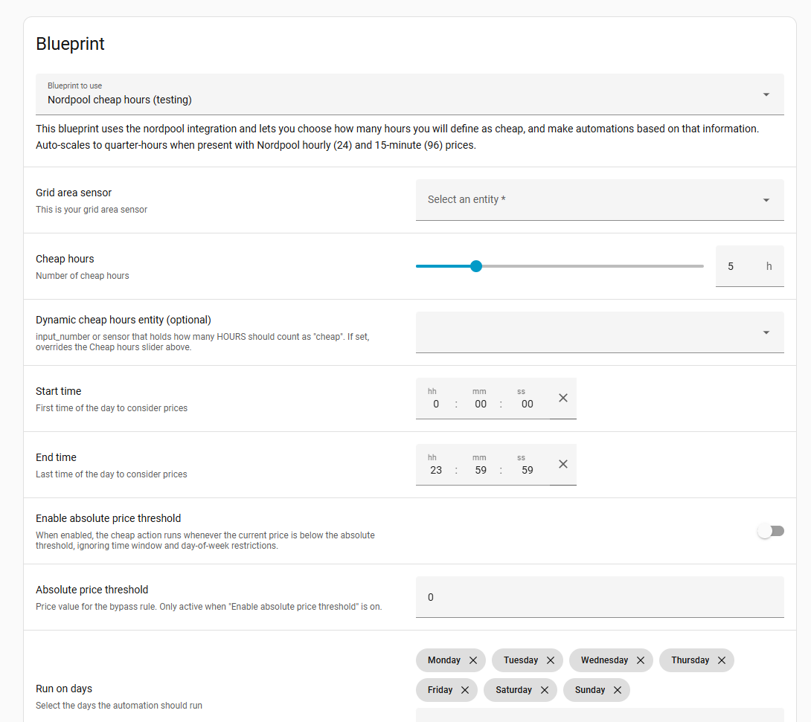

# Nordpool chepeast hours blueprint for Home Assistant

This blueprint uses the [custom nordpool](https://github.com/custom-components/nordpool) integration and let's you choose how many hours you will define as cheap, on what day, sequential/not sequential hours, on what time and make automations based on that information.

**NB!** This works on 15min and 1hour prices.

Let's you choose sensor and enities.

## How to install
* Open yaml file from this repo and copy address
* Open HA Settings > Automation and Scenes > Blueprints > Import blueprint
* Paste previously copied address and import

## Known issuses
* May find more hours than set if hours are not sequential and next price is same as ending price.

## TODO
* Add sequential hours.
* Add working hours range

## Good resources and inspiration
* https://github.com/kotope/ha_nordpool_cheapest_hours
* https://github.com/custom-components/nordpool
