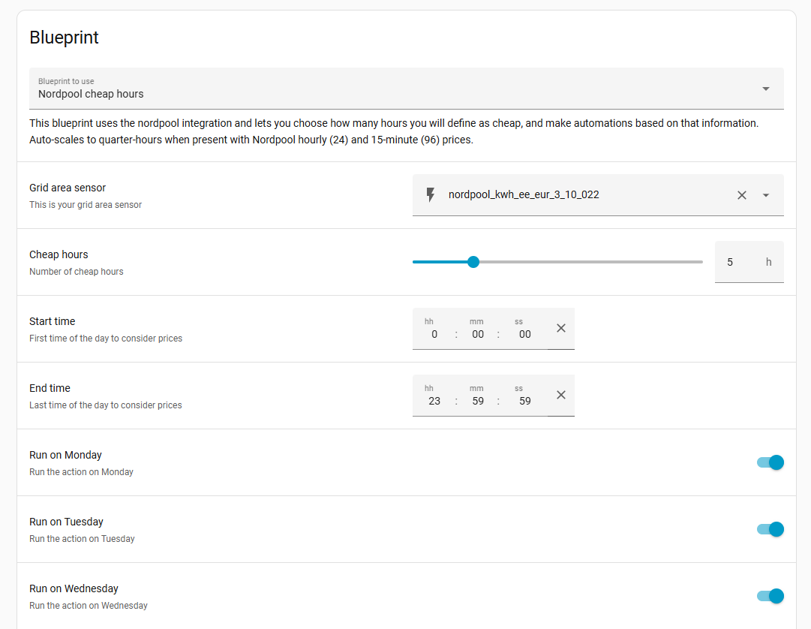

# Nordpool chepeast hours blueprint for Home Assistant

This blueprint uses the [custom nordpool](https://github.com/custom-components/nordpool) integration and let's you choose how many hours you will define as cheap, on what day, sequential/not sequential hours, on what time and make automations based on that information.

**NB!** This works on 15min and 1hour prices.

Let's you choose sensor and enities.




[](https://www.buymeacoffee.com/kullarkert)

## Features
- **Time range filtering**: Set start and end times to only search for cheap hours within a specific window (e.g., 06:00-22:00). Actions will only trigger within this time window.
- **Weekday selection**: Choose which days of the week to run automations.
- **Flexible thresholds**: Define how many hours should be considered "cheap".
- **Auto-scaling**: Automatically handles both hourly (24 prices) and 15-minute (96 prices) Nordpool data.

## How to install
* Open yaml file from this repo and copy address
* Open HA Settings > Automation and Scenes > Blueprints > Import blueprint
* Paste previously copied address and import


## Prerequisites

### Required: Nordpool Custom Integration
This blueprint requires the [Nordpool custom integration](https://github.com/custom-components/nordpool) to be installed and configured in Home Assistant.

### Nordpool Sensor Structure
The blueprint expects your Nordpool sensor (e.g., `sensor.nordpool_kwh_ee_eur_3_10_022`) to provide these attributes:

**Core attributes:**
- `current_price` (float): Current electricity price for the active time slot - **Right now as 12.10.2025 current price does not return correct price on 15min prices.**
- `today` (list): Array of 24 hourly prices OR 96 quarter-hour prices for today
- `raw_today` (list): Detailed price data with timestamps for today (each entry has `start`, `end`, `value`)
- `raw_tomorrow` (list): Detailed price data for tomorrow (available after ~13:00 CET, empty `[]` before that)

**Additional metadata attributes:**
- `unit` (string): Price unit, e.g., `"kWh"`
- `currency` (string): Currency code, e.g., `"EUR"`, `"SEK"`
- `country` (string): Country name, e.g., `"Estonia"`
- `region` (string): Grid region code, e.g., `"EE"`, `"SE3"`
- `price_in_cents` (boolean): Whether prices are in cents/öre (true) or full currency units
- `average`, `min`, `max`, `mean` (floats): Statistical summary of the day's prices
- `tomorrow_valid` (boolean): Whether tomorrow's prices are available yet

**Example sensor state structure:**
```yaml
state: 24.401  # Current price (same as current_price attribute)
attributes:
  current_price: 24.401
  unit: kWh
  currency: EUR
  country: Estonia
  region: EE
  price_in_cents: true
  unit_of_measurement: c/kWh
  
  # Price statistics
  average: 11.946
  min: 1.347
  max: 35.864
  mean: 8.856
  
  # Today's prices (96 values = 15-minute slots, OR 24 values = hourly)
  today:
    - 8.955
    - 8.741
    - 6.832
    - 6.831
    # ... 92 more values for 15-min (or 20 more for hourly)
  
  # Detailed today prices with timestamps
  raw_today:
    - start: "2025-10-10T00:00:00+03:00"
      end: "2025-10-10T00:15:00+03:00"
      value: 8.955
    - start: "2025-10-10T00:15:00+03:00"
      end: "2025-10-10T00:30:00+03:00"
      value: 8.741
    # ... continues for all 96 slots (or 24 for hourly)
  
  # Tomorrow's prices (empty until ~13:00, then populated)
  tomorrow: []
  raw_tomorrow: []
  tomorrow_valid: false
```

**Data formats:**
- **Hourly mode**: 24 prices in `today` array (one per hour, 00:00-23:00)
  - `raw_today` has 24 entries with 1-hour intervals (e.g., 00:00:00 → 01:00:00)
- **15-minute mode**: 96 prices in `today` array (four per hour, 00:00-23:45)
  - `raw_today` has 96 entries with 15-minute intervals (e.g., 00:00:00 → 00:15:00)
- The blueprint **auto-detects** the format by checking `today` array length

**Important notes:**
- Prices in `today` array are ordered chronologically (index 0 = first slot of the day)
- `raw_today`/`raw_tomorrow` include ISO 8601 timestamps with timezone (e.g., `+03:00`)
- The blueprint uses `raw_*` attributes first (most accurate timestamp matching), falls back to `today` index calculation
- Tomorrow's prices (`raw_tomorrow`, `tomorrow`) become available around 13:00-14:00 CET each day
- `tomorrow_valid: false` indicates tomorrow's data is not yet available
- Each `raw_today` entry uses `value` field (not `price`) for the price amount


## Known issuses
* May find more hours than set if hours are not sequential and next price is same as ending price.

## TODO
* Add sequential hours.


## Good resources and inspiration
* https://github.com/kotope/ha_nordpool_cheapest_hours
* https://github.com/custom-components/nordpool
